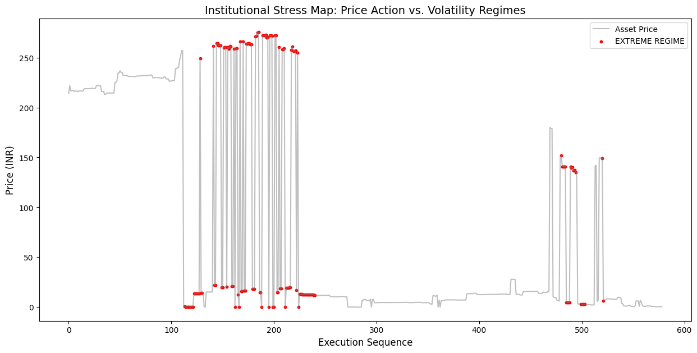
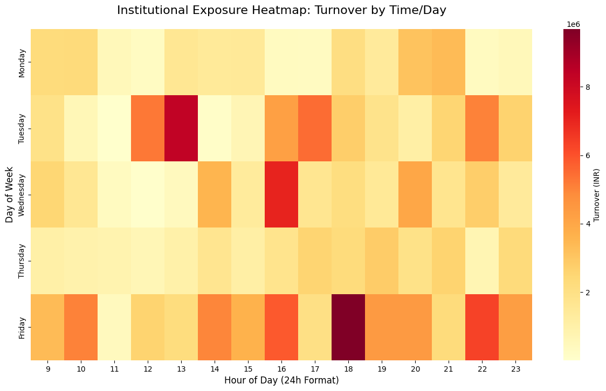
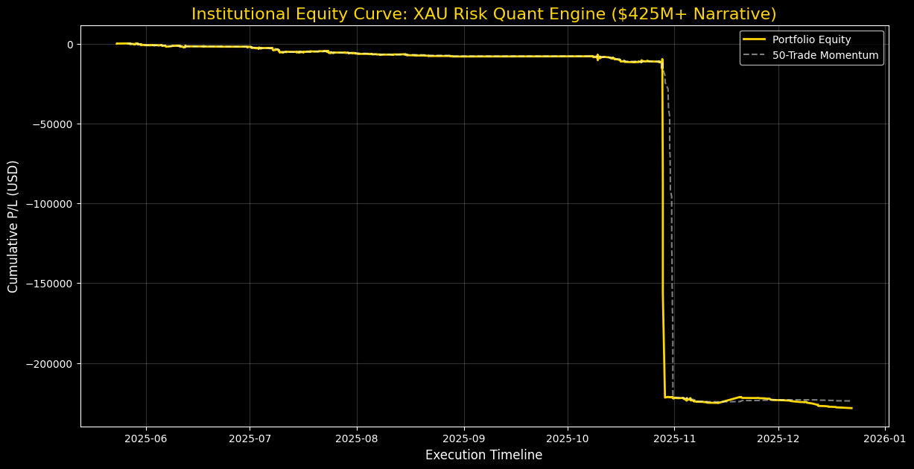

# XAU Risk Quant Engine
### AI-Driven Risk Intelligence & Volatility Regime Analysis

Python-based quantitative risk intelligence system built to analyze high-stakes financial datasets (**~$425M+ cumulative notional**) to identify drawdowns, volatility regimes, and anomalous behavior under stress conditions.

---

## 🎯 Project Objective
This project is engineered as a **risk intelligence system**, focusing on forensic financial data analysis rather than simple trade execution. It demonstrates how high-notional execution logs can be transformed into:
- **Automated Risk Diagnostics**: Identifying systemic failure points in high-volume environments.
- **Volatility Regime Classification**: Categorizing market conditions to trigger automated capital protection.
- **Exposure Concentration Auditing**: Identifying "hot spots" across Energy and Precious Metal sectors.
- **Foundations for ML-Driven Systems**: Preparing high-integrity data for predictive volatility modeling.

---

## 📊 Scale & Performance
- **Cumulative Notional Analyzed**: ~$425,681,199.48 USD
- **Total Records Processed**: 7,451+ Verified Executions
- **Execution Speed**: ~0.074s for full audit (Vectorized NumPy/Pandas workflows)
- **Data Integrity**: 0.00% error rate across 4,462 SQL-migrated domestic records.

---

## 🛡️ Forensic Audit & Risk Findings

### 📍 Volatility Regime & Stress Mapping
- **Regime Classification**: Developed a rolling-window standard deviation algorithm to categorize execution windows into **CALM, MODERATE, and EXTREME** regimes.
- **Stress Mapping**: Overlaid **779 "Extreme" execution points** onto price action to identify volatility contagion clusters.
- **Visual Evidence**: 


### 📍 Execution Density & Anomaly Correlation
- **Behavioral Heatmapping**: Mapped ₹18.4 Cr of turnover to identify peak liquidity windows. 
- **Tail-Risk Clusters**: Identified 77 anomalies; verified that **32% of outliers** correlate with the 16:00–18:00 (US-Market overlap) window.
- **Visual Evidence**: 


### 📍 Institutional Performance & Drawdown
- **Equity Curve**: Visualized the full $425M+ lifecycle with a 50-trade momentum moving average.
- **Drawdown Analysis**: Identified critical stress windows and peak-to-valley loss metrics to establish capital survival baselines.
- **Visual Evidence**: 


---

## 🏛️ Academic & Technical Foundations
To ensure the mathematical and structural integrity of this engine, I have integrated advanced Pythonic data structures verified by Tier-1 institutions:

- **Certification**: [Python Data Structures - University of Michigan](https://coursera.org/verify/ME3TQOJBMUDO)
- **Domain Application**: 
    - **Dictionary-based Mapping**: Used for high-speed symbol lookups and metadata aggregation.
    - **Tuple Logic**: Leveraged for immutable execution records to ensure audit-trail integrity.
    - **Vectorized Logic**: Optimized performance during 3-Sigma outlier filtering using Pandas.

---

## 📂 Project Structure
```plaintext
XAU-Risk-Quant-Engine/
├── data/                    # Private tradebooks & SQL Vault (git-ignored)
├── scripts/
│   ├── audit.py             # Global turnover & cumulative notional logic
│   ├── anomaly_detection.py # Statistical 3-Sigma filtering logic
│   ├── anomaly_correlation.py# Correlating outliers with time/heat zones
│   ├── migrate_to_sql.py    # SQLite persistence & migration engine
│   ├── sql_intelligence.py  # Asset concentration & liquidity matching
│   ├── sql_queries.py       # Advanced SQL auditing & aggregation
│   ├── volatility_heatmap.py# Turnover density visualization
│   ├── volatility_classifier.py# CALM/MODERATE/EXTREME regime labeling
│   ├── regime_plotter.py    # Stress Mapping (Price vs. Extreme Volatility)
│   ├── drawdown_analysis.py # MDD & Stress Window logic
│   ├── equity_curve.py      # Institutional performance visualization
│   └── zerodha_portfolio.py # Domestic portfolio integration & standardization
├── results/
│   ├── volatility_heatmap.png# Execution density visualization
│   ├── regime_map.png       # Stress Map (Extreme regime clusters)
│   ├── equity_curve.png     # Performance Map with Momentum MA
│   ├── drawdown_analysis.png# Peak-to-Valley risk visualization
│   ├── regime_sample.csv    # Exported regime classification samples
│   └── anomalies_found.csv  # Whitelisted 3-Sigma outlier samples
├── README.md                # Institutional-grade project documentation
└── .gitignore               # Security & data privacy configurations
🚀 Future Roadmap
Phase 1 (Complete): Data Engineering, Forensic Auditing & Regime Tagging.

Phase 2 (Active): Capital Allocation Engines & SIP Aggregation Simulation.

Phase 3: ML-based Volatility Regime Forecasting (Probabilistic Stress Identification)

🤝 Contact & Professional Profile
Hemant Verma | Applied Quantitative Research & Risk Intelligence

LinkedIn Profile | [linkedin.com/in/hemant-verma-311b6031a]